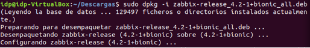

 # 
**Monitorización con Zabbix.**
##Creamos primero las máquinas que usaremos, una ubuntu y una windows.

Máquina 1;

Ubuntu

Máquina 2;

Windows

Y las conectamos mediante "Red NAT".

Y le haremos un ping al cliente.

Descargamos el Zabbix desde el repositorio.

Y lo instalamos.

Instalamos el paquete descargado antes:

Actualizamos los repositorios.

Instalamos los paquetes necesarios para el servidor Zabbix.

Conectamos el servidor con la base de datos.

Creamos la base de datos.

Creamos al usuario Zabbix con contraseña password y le damos los privilegios sobre la base de datos Zabbix;

Cerramos mysql

Importamos el esquema incial y los datos, utilizando la contraseña antes creada:

En la configuración nos va a pedir los requisitos.

Nos aseguramos de que esté todo en “OK”.
Y configuramos la base de datos.

Y en los detalles del servidor, le pondremos de nombre, “Zabbix”.

Y nos dará un resumen de la configuración.

Y procederemos a la finalización.

Después nos pedirá loguearnos con nuestro usuario y contraseña definidos anteriormente.
Usuario: Admin 
Contraseña: Zabbix
Y veremos la interfaz.

Ahora pasaremos a crear un “Host” para monitorizar.

Y le daremos arriba a la derecha, donde nos pone “Create Host”.

Entraremos y rellenamos los apartados.

En “groups” le daremos a seleccionar y elegiremos el “Name” para seleccionarlo todo.

En “agents interfaces” le daremos a “add” para añadir un nuevo agente.

Y le pondremos la ip asignada a nuestra otra máquina.

Posterior a esto, nos iremos a “templates”, situado en la barra de herramientas arriba y vamos a buscar en “seleccionar” hasta que encontremos “template Linux”.

Y le daremos a “Add” y posterioemente a “update”.

Nos vamos a “Monitoring” y pulsamos en “Graph” para dirigirnos a “Hosts” y pulsar el nombre del Host que le dimos anteriormente.

Ahora vamos a la máquina cliente, y nos descargamos el “agente zabbix” y realizamos la conexión para que esta se establezca con nuestro servicio.

Continuamos con la instalación.

Y desactivamos el firewall de red.

Posteriormente, iremos a la página y veremos que nos empezará a actualizar la información en los parámetros y después en la gráfica.

Y vamos a “dashboard” para dirigirnos a “all dashboard” y vamos abajo del todo para ver el rendimiento de nuestro sistema.

# Rendimiento de Red.

Y para hacer la administración de rendimiento red, iremos a “hosts”, seleccionaremos cualquiera de los dos, Zabbix server que el rendimiento lo proporcionará la propia máquina servidor o Windows-pc que lo proporcionará el Windows.

Y seleccionamos uno.

Y pinchamos en Web.

Y arriba derecha, nos dirigimos a “Create Web scenario” y aquí rellenamos el nombre y nueva aplicación con los datos que queramos.

Iremos entonces a la gráfica web y nos empezará a medir el rendimiento.

Y lo rellenamos con los datos que necesitemos.

Le daremos a “Add” y por último, nos iremos a “Dashboard” > “Web” y dándole a “Zabbix frontend” en mi caso, accederemos a la monitorización web.

